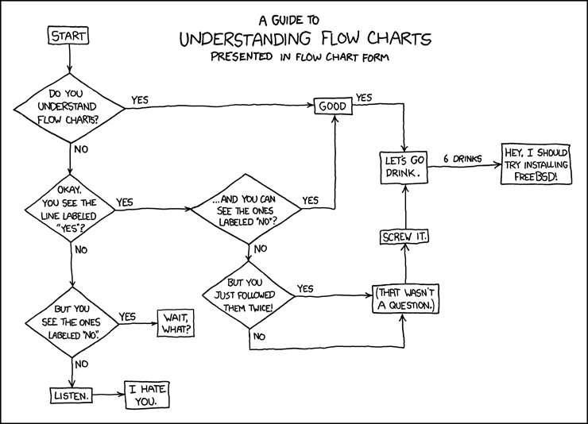

#Organization of Computer Systems Final Project
American University

Author: Kristof Aldenderfer

Description: For my final project, I have rebuilt Snake Game in AVR Assembly. It uses the ATMega328PB Xplained development board and the Sparkfun Breakout Proto board as its base.

Input: 4x buttons (D-pad)
Output: Adafruit SSD1306 OLED screen breakout board

##Flowchart

(Source: <https://xkcd.com/518/>)

##Hardware Schematic

(Source: <http://www.juanitahydabrek.com/furby/>)